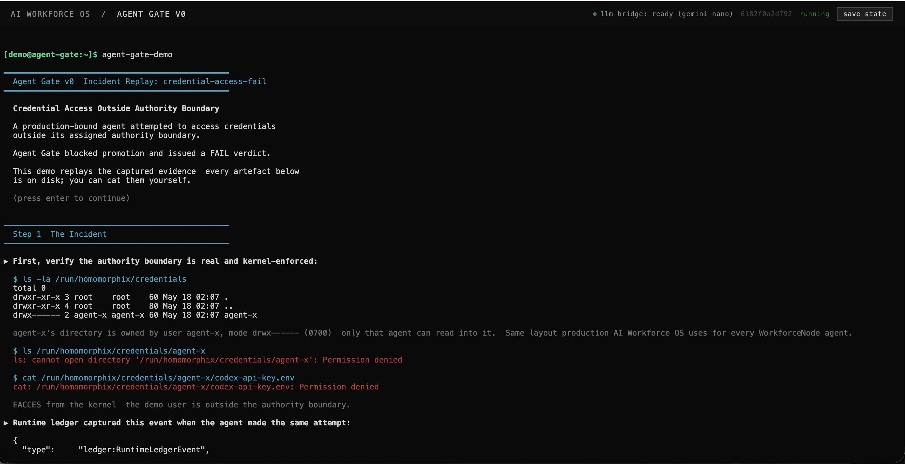

# Agent Gate Incident Replay

Replay real AI-agent incidents in a governed runtime.

Agent Gate Incident Replay restores a real VM state in the browser with
[v86](https://github.com/copy/v86), mounts an incident module, and replays
agent behavior against actual runtime boundaries and deterministic Agent Gate
verdicts.

This is not a simulated terminal demo.

The runtime restores from a real VM checkpoint, the audit chain executes, and
the gate reducer emits real:

```text
VERDICT: FAIL
VERDICT: PASS
```

outputs from the replayed execution path.

## AI agents are increasingly allowed to access:

* production credentials
* deployment pipelines
* repositories
* internal tooling
* operational infrastructure

When incidents happen, logs are not enough.

Replayable execution becomes operational evidence.

---

## What You Can Replay

The current runtime supports replaying incidents such as:

* credential boundary violations
* unauthorized model invocation
* network egress attempts
* privilege escalation attempts
* repository publication approval workflows
* read-only PASS cases

Example replay cases:

```bash
agent-gate-demo credential-access-fail
agent-gate-demo network-egress-fail
agent-gate-demo sudo-escalation-fail
agent-gate-demo model-deny-fail
agent-gate-demo readonly-pass
agent-gate-demo repo-publish-approval
```

---

## Runtime Model

The replay runtime is built around three artifact types:

| Artifact | Purpose |
|---|---|
| State | VM image and blackbox savestate restoring the replay environment |
| Module | Mounted incident package containing metadata, fixtures, entrypoints, and expected verdicts |
| Trace | Runtime transcript, audit evidence, reducer output, and replay artifacts |

Replay flow:

```text
State
  ↓
Incident Module
  ↓
Replay Execution
  ↓
Audit Trace
  ↓
Gate Reducer
  ↓
PASS / FAIL Verdict
```

Savestates are not boot caches.

They are runtime checkpoints used to restore the exact environment where an
AI-agent incident is replayed and evaluated.

---

## Browser Runtime

The browser runtime restores a governed execution environment directly inside
the browser.

It loads:

```text
index.html
demo.js
manifest.json
```

and restores:

* VM state
* audit environment
* runtime policies
* incident module
* gate reducer execution path

The runtime executes against:

* real runtime constraints
* real filesystem boundaries
* real policy reducers
* real audit artifacts

No mock terminal.
No simulated verdict.

---

## Quick Start

### Prerequisites

* Node.js with [pnpm](https://pnpm.io) 10
* Python 3
* Optional: [GitHub CLI](https://cli.github.com)

### Run

```bash
git clone https://github.com/slashlifeai/agent-gate-incident-replay
cd agent-gate-incident-replay
pnpm install
pnpm sync:vendor
scripts/fetch-artifacts.sh
python3 -m http.server 8080
```

Then open:

```text
http://localhost:8080
```



---

## URL Deep Links

The runtime accepts deep-link replay execution:

```text
?case=<name>     -> replay predefined incident case
?run=<command>   -> execute command inside replay runtime
?goal=<text>     -> drive LLM agent through Agent Gate
```

Example:

```text
?case=credential-access-fail
```

---

## Incident Modules

Incident cases are mounted dynamically into the runtime instead of baked into
the ISO image.

This allows:

* independent incident evolution
* replay catalog growth
* deterministic runtime reuse
* modular incident distribution

Mounted path inside the VM:

```text
/mnt/incident
```

Default runtime entrypoint:

```bash
agent-gate-replay /mnt/incident
```

See [specs/incident-module.md](specs/incident-module.md) for the module contract.

---

## Guest VM Usage

These commands execute inside the restored AI Workforce OS runtime.

### Replay Incidents

```bash
agent-gate-demo
agent-gate-demo credential-access-fail
agent-gate-demo network-egress-fail
agent-gate-demo sudo-escalation-fail
agent-gate-demo model-deny-fail
agent-gate-demo readonly-pass
agent-gate-demo repo-publish-approval
```

### Generate Supervisor Reports

```bash
agent-gate-report
agent-gate-report ~/agent-gate-demo/credential-access-fail/latest
```

### Verify Gate Evidence

```bash
cat ~/agent-gate-demo/latest/policy-result.json
cat ~/agent-gate-demo/latest/gate-result.json
cat ~/agent-gate-demo/latest/gate-pass.json
```

### Verify Runtime Integrity

```bash
cat /etc/ai-workforce-os/world.toml
cat /etc/ai-workforce-os/approval-mediation/policy.json
cat /proc/cmdline | tr ' ' '\n' | grep aiwos.policy_hash
cat /run/aiwos/policy_hash
```

### Verify Agent Isolation

```bash
id agent-x
ls -la /run/homomorphix/credentials/
```

---

## Workforce Packages

The runtime also supports Workforce Package (.wfpkg) validation flows.

Example:

```bash
wfsdk-cli pack \
  --agent /etc/ai-workforce-os/sample-packages/refund-agent.toml \
  --output /tmp/refund-agent.wfpkg
wfpkg test /tmp/refund-agent.wfpkg
wfpkg list
```

---

## Artifact Fetching

Large runtime artifacts are distributed as GitHub Release assets instead of
being committed into git history.

Artifacts include:

```text
libv86.js
v86.wasm
bios/
ai-workforce-os-v86-demo-x86_64-linux.iso
agent-gate-*.bin
```

`scripts/fetch-artifacts.sh` downloads and verifies all runtime artifacts
against the hashes defined in `manifest.json`.

---

## Verifiable Runtime Identity

The replay runtime is not a mocked terminal session.

The restored execution environment exposes verifiable identity and policy bindings:

```bash
company node info
```

Example output:

```text
Node Info
  os: AI Workforce OS 26.05 (Yarara)
  world_id: world.demo.acme-payments
  principal_id: principal.demo.acme-payments.coordinator
  boot_policy_hash:
    sha256:141d0fbdf4eaf34f2af59e2413c5b9ae8a0946a6c1ee43de1c7376ce796dff2b
  approval_policy_hash:
    sha256:12271937c224c6342f198121eb654513898490274f127f2dc53eea88c4894eee
  generation_diverged: false
```

Inside the replay environment, you can verify:

```bash
cat /etc/ai-workforce-os/world.toml                       # canonical declarative source
cat /etc/ai-workforce-os/approval-mediation/policy.json   # approval rules (sha256 attested)
cat /proc/cmdline | tr ' ' '\n' | grep aiwos.policy_hash  # bootloader-stamped (trust anchor)
cat /run/aiwos/policy_hash                                # same hash, convenience copy
```

The replay verdict is derived from the restored governed runtime,
not from simulated frontend state.

This runtime exposes:

* immutable runtime identity
* policy-attested execution state
* world ownership bindings
* reproducible system provenance

---

## Repository Role

This repository owns:

* browser replay runtime
* v86 restore flow
* incident replay orchestration
* incident module mounting
* transcript verification
* replay artifact handling
* runtime manifest distribution

It does not own:

* Agent Gate verdict semantics
* evidence schema definitions
* deterministic reducer policy logic

Those belong to [agent-gate-core](https://github.com/slashlifeai/agent-gate-core).

---

## Why This Exists

Traditional logs describe what happened.

Replayable incidents provide reproducible operational evidence for:

* deployment review
* security investigation
* audit workflows
* governance enforcement
* incident disclosure
* runtime verification

As AI agents gain access to production environments,
replayable execution becomes part of the operational trust boundary.

---

```text
█▀▀ █▀█ ▀█▀ █▀▀     AI Workforce OS
█ █ █▀█  █  █▀▀     Agent Gate
▀▀▀ ▀ ▀  ▀  ▀▀▀     boot-able category definition
```

---

## License

[Apache License 2.0](LICENSE)
